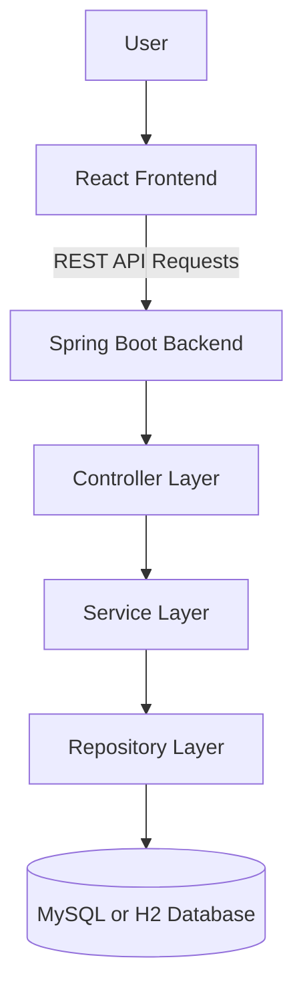
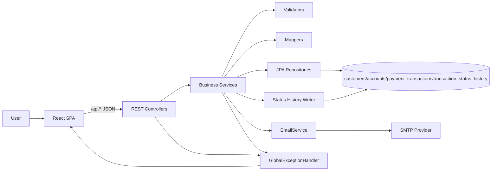
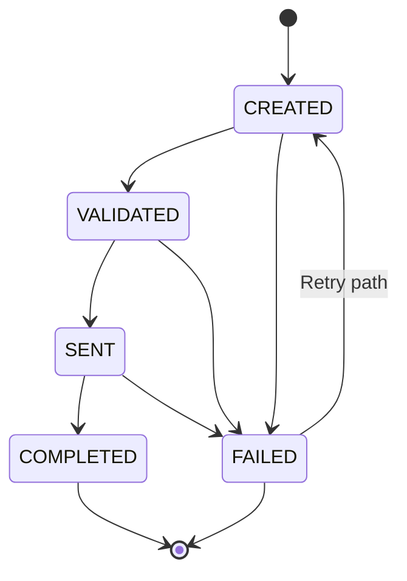
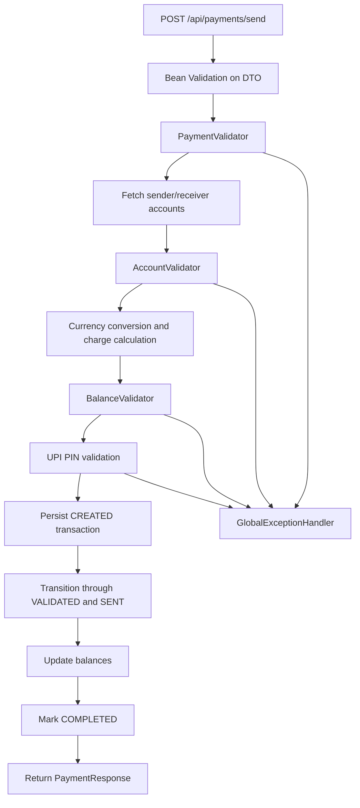
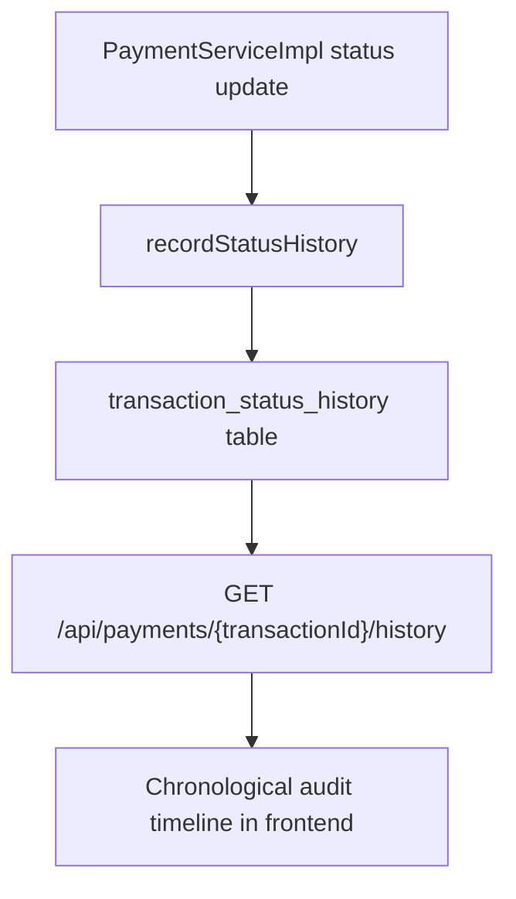
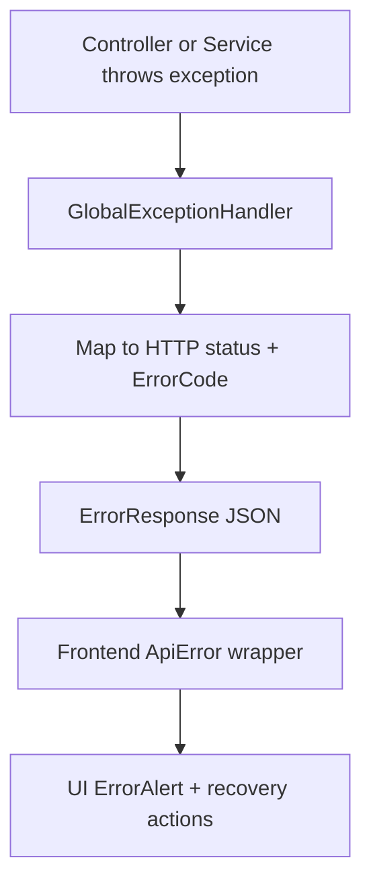

# Payment Processing System (PayPilot)

A full-stack payment processing platform built with Spring Boot and React for simulating account-to-account transfers, transaction lifecycle management, customer operations, and support analytics.

## Overview

This project solves the problem of managing digital payment operations in a structured, auditable, and testable way. It provides:

- A guided payment flow (sender selection, receiver verification, preview, confirmation, execution)
- Transaction lifecycle control with status transitions (`CREATED -> VALIDATED -> SENT -> COMPLETED/FAILED`)
- Customer and account discovery endpoints for operational workflows
- Support-facing transaction and analytics views
- Standardized error handling for API consumers

### Payment processing workflow

1. User selects sender customer and account.
2. User enters receiver account and verifies receiver details.
3. User previews conversion, charges, and total deducted amount.
4. User confirms with UPI PIN.
5. Backend validates request, accounts, and balance.
6. Backend persists transaction and status history across lifecycle stages.
7. Backend updates balances and returns a transaction response.
8. For high-value transfers (`> 10000`), backend attempts an email notification.

## Features

### Core payment features

- Multi-step payment wizard in frontend
- Payment preview endpoint before transfer execution
- Currency conversion support (`INR`, `USD`, `EUR`, `GBP`)
- Transfer charge computation for cross-currency transfers
- Transaction retry flow for failed payments
- High-value transaction email notification (configurable)

### Transaction lifecycle and resiliency

- Explicit status machine enforced by validator
- Status history persisted in `transaction_status_history`
- Duplicate payment protection using idempotency key at persistence/service layer
- Structured exception model with consistent API error payload

### Customer and support operations

- Customer list and customer account lookup
- Customer transaction history and single-transaction detail retrieval
- Support dashboard metrics (totals, successful/failed counts, debit/credit totals)
- Support transaction filters by customer and status

### DX and operations

- OpenAPI/Swagger UI integration
- Dual DB profiles: local H2 and MySQL with Flyway migrations
- Dockerized backend and frontend
- `docker-compose` orchestration for full stack
- Jenkins pipeline for test/build/image/deploy automation

## Technology Stack

### Backend technologies

- Java 17
- Spring Boot (Web, Validation, Data JPA, Mail)
- Flyway
- Lombok
- springdoc OpenAPI

### Frontend technologies

- React 18
- React Router v6
- Vite
- Plain CSS (component and page-level styling)

### Database

- MySQL 8.4 (containerized profile)
- H2 in-memory DB (local profile)

### Development tools

- Maven Wrapper (`mvnw`, `mvnw.cmd`)
- npm
- JUnit 5, Mockito, Spring Boot Test
- JaCoCo

### Deployment tools

- Docker
- Docker Compose
- Nginx (frontend static hosting + `/api` reverse proxy)
- Jenkins (CI/CD pipeline)

## System Architecture

### High-level architecture



### Detailed architecture with validation, audit, and notifications



## Payment Lifecycle Flow



## Validation Process Flow



## Audit Logging Flow



## Error Handling Flow



## Problem Solved

The application provides a complete reference workflow for digital payment operations where transaction integrity, lifecycle tracking, and customer/support visibility are all handled in one system. It is useful for:

- Demonstrating payment domain architecture
- Practicing backend transaction workflows
- Validating frontend-backend integration patterns
- Testing operational support flows and failure handling

## Complete User Flow

1. Open frontend and navigate to `Payments`.
2. Select sender customer and sender account.
3. Enter receiver account and verify details from backend.
4. Enter amount and preview conversion/charges.
5. Enter UPI PIN and confirm transfer.
6. View payment result with transaction ID.
7. Go to `Transactions` to inspect timeline or retry failed transfer.
8. Go to `Customers` for account-specific transaction history.
9. Go to `Support` for system-wide and customer-specific analytics.

## Backend Architecture

### Package structure

- `config`: CORS, mail, and OpenAPI configuration
- `controller`: REST endpoints (`Account`, `Customer`, `Payment`, `Support`)
- `service` and `service.impl`: business logic orchestration
- `repository`: JPA data access
- `model`: JPA entities (`Customer`, `Account`, `PaymentTransaction`, `TransactionStatusHistory`)
- `dto`: API request/response contracts
- `validation`: business validation components
- `mapper`: entity-to-DTO converters
- `exception`: custom exceptions + `GlobalExceptionHandler`
- `email`: notification service abstraction/implementation

### Key backend design decisions

- Strict transaction state transitions via `StatusTransitionValidator`
- Status history table for auditable lifecycle tracking
- Separation of concerns: validators + services + mappers
- Centralized error mapping with machine-readable `ErrorCode`
- Profile-driven DB behavior (`local`: H2 with `data.sql`, `mysql`: Flyway-managed MySQL)

### Security note

- No Spring Security/JWT/authentication layer is configured in the current codebase.
- UPI PIN verification is business validation inside payment execution.

## Frontend Architecture

### Routing and page modules

- `overview`: dashboard metrics + recent activity
- `payments`: wizard-style transfer flow
- `transactions`: transaction inspection + retry
- `customers`: customer/account/transaction lookup
- `support`: transaction and customer support analytics

### Frontend design decisions

- Feature-based folder structure
- Shared API module and shared UI components
- Environment-driven API base URL and optional demo fallback mode
- Client-side flow control with React state hooks

## API Communication Flow

Frontend API modules map directly to backend endpoints:

- `customerApi.js` -> `/api/customers*`
- `paymentApi.js` -> `/api/payments*`
- `supportApi.js` -> `/api/support*`

Request path:

1. UI action triggers API helper.
2. `apiRequest` performs `fetch` with JSON headers.
3. Backend returns DTO or standardized `ErrorResponse`.
4. Frontend parses response into page state.
5. UI renders table/cards/alerts.

## Database Design

### Entities and relationships

- `customers` (1) -> (N) `accounts`
- `accounts` (1) -> (N) `payment_transactions` as sender
- `accounts` (1) -> (N) `payment_transactions` as receiver
- `payment_transactions` (1) -> (N) `transaction_status_history`

### Schema evolution (Flyway)

- `V1` customer table
- `V2` account table
- `V3` payment transaction table
- `V4` transaction status history table
- `V5` and `V6` seed data
- `V7` and `V8` account currency and daily limit additions
- `V9` currency alignment updates
- `V10` conversion fields on transactions

### Data flow (request to response)

1. Frontend sends payment payload to backend.
2. Controller validates and delegates to service.
3. Service executes validators and business rules.
4. Repositories persist transaction/status/balance changes.
5. Mapper/DTO response returned to frontend.

## API Endpoints (Current)

### Account

- `GET /api/accounts/{accountId}`

### Customer

- `GET /api/customers`
- `GET /api/customers/{customerId}/accounts`
- `GET /api/customers/accounts?customerName=&email=&phoneNumber=`
- `GET /api/customers/{customerId}`
- `GET /api/customers/account/{accountNumber}`
- `GET /api/customers/{accountNumber}/transactions`
- `GET /api/customers/transaction/{transactionId}`

### Payments

- `POST /api/payments/send`
- `POST /api/payments/preview`
- `POST /api/payments/retry/{transactionId}`
- `GET /api/payments`
- `GET /api/payments/{transactionId}`
- `GET /api/payments/status/{status}`
- `GET /api/payments/{transactionId}/history`

### Support

- `GET /api/support/dashboard`
- `GET /api/support/transactions`
- `GET /api/support/customer/{accountNumber}`
- `GET /api/support/status/{status}`

## Additional Implementations Beyond Basic Payment Transfer

- Multi-currency conversion and transfer charge preview/execution
- Transaction status history/audit timeline endpoint
- Retry validator with max retry policy
- High-value email notification path
- Support dashboard and customer analytics UI
- Dockerized full-stack deployment and CI/CD pipeline
- Demo fallback behavior in frontend when backend is unavailable

## Run Options

### Local backend (H2 profile)

```powershell
.\mvnw.cmd spring-boot:run
```

### Full stack with Docker Compose

```powershell
docker compose up --build
```

- Frontend: `http://localhost`
- Backend API: `http://localhost:8080/api`
- Swagger UI: `http://localhost:8080/swagger-ui.html`

## Notes

- The root README focuses on architecture and behavior of the current codebase.
- Frontend-specific run details are also documented in `frontend/README.md`.

